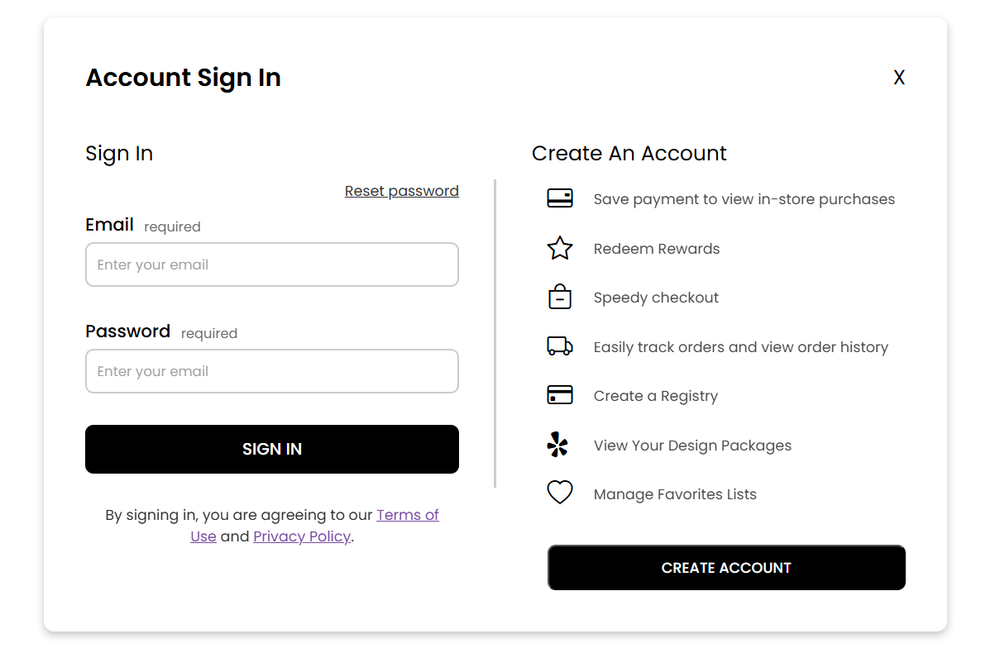
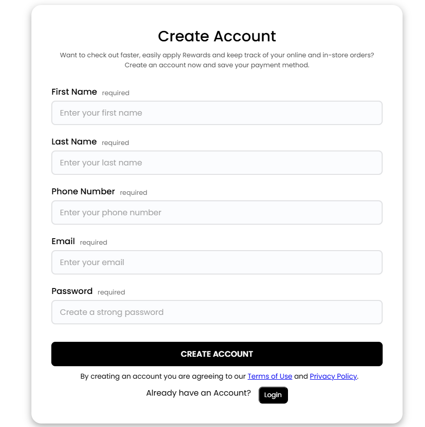
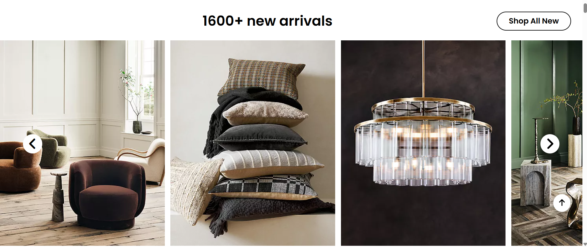

# 🚀 CozyNest – Modern Home Decor & Furniture Store
### A fully responsive, animated, and dynamic frontend e-commerce website.

<p align="center">
  
  
  
  
</p>

---

## 🌟 About the Project

**CozyNest** is a modern, premium-quality e-commerce front-end website where users can browse home decor, furniture, kitchen essentials, and more.  
The website is fully **responsive**, **interactive**, and **JavaScript-powered** with multiple dynamically rendered sections.

---

# 📸 Screenshots


### 🏠 Home Page  


### 🔐 Sign In Page  


### 📝 Create Account Page  


### 🛋 Dynamic New Arrivals  


### 🍁 Autumn Decor Section  


---

# ✨ Features

## 🔐 User Authentication

### 👉 Create Account
- Strong password validation (uppercase, lowercase, number, special character)
- Name validation (alphabets only)
- Phone number validation (10 digits only)
- Email `"."` position validation
- Strong password validation:  
  - Uppercase  
  - Lowercase  
  - Number  
  - Special character  
- Duplicate email check
- Animated **Success Popup**
- Auto-clears form

### 👉 Login
- Validates user email & password via localStorage
- Shows logged user’s name on homepage
- Auto-redirect to homepage

---

## 🏠 Homepage Features
- Dynamic **New Arrivals**
- Dynamic **Hero Cards**
- Dynamic **Hosting Category**
- Dynamic **Autumn Decor**
- Dynamic **Ways to Shop**
- Scroll-to-top floating button
- Video with Play/Pause button
- Promotional hero banners
- Seasonal highlights  
- Fully responsive for mobile screens

---

# 🎨 UI & UX Highlights

### 🧭 Header & Navigation
- Multi-level dropdown menus  
- Location, Wishlist, Cart popup interactions  
- Smooth animations  

### 🎬 Video Section
- Large banner video  
- Custom play/pause button  
- Overlay text & CTA buttons  

### 🛋 Product Display
- High-resolution lifestyle banners  
- Seasonal collections  
- Kitchen, Bedding, Living Room categories  

---

# 🧠 Tech Stack

| Technology | Purpose |
|-----------|---------|
| **HTML5** | Website structure |
| **CSS3** | Styling and responsiveness |
| **JavaScript (ES6)** | Logic & dynamic rendering |
| **Bootstrap Icons** | Icons |
| **Google Fonts** | Modern typography |
| **localStorage** | User data handling |

---

# 📁 Folder Structure
```
CozyNest Project
│── index.html
│── /HTML
│ ├── Create_Account.html
│ └── SignIn_Page.html
│
│── /CSS
│ ├── style.css
│ ├── Create_Account.css
│ └── SignIn_Page.css
│
│── /JS
│ ├── script.js
│ ├── Create_Account.js
│ └── SignIn_Page.js
│
└── /Utilities
└── /img (Images)

```

No server required — the entire project runs on the frontend ✔

---

# 🚀 Future Enhancements
- Backend API Integration  
- JWT Login System  
- Add to Cart feature  
- Wishlist feature  
- Product Filtering  
- Product Detail Page  

---

# 👨‍💻 Author

**Md Rahmat Ali**  
Frontend Developer • UI/UX Enthusiast  

---

# ⭐ Support

If you like this project, please **give it a ⭐ on GitHub!**

Hello
